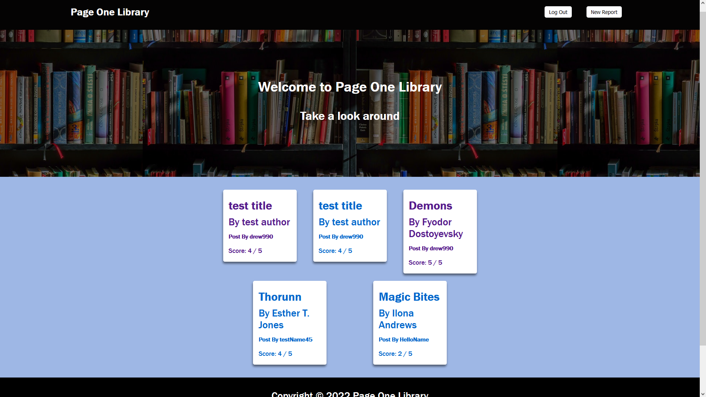
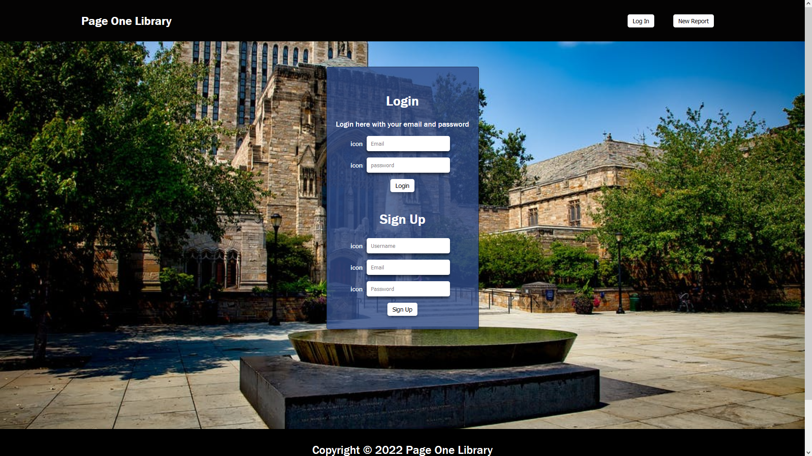
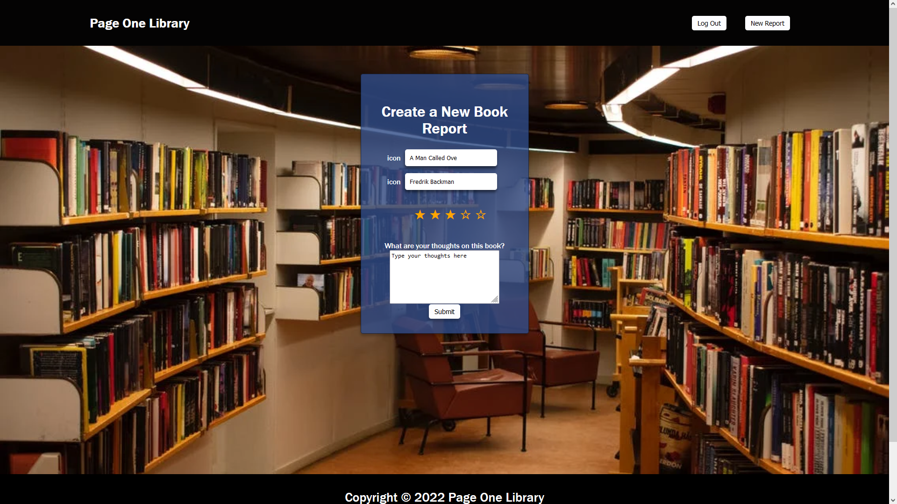
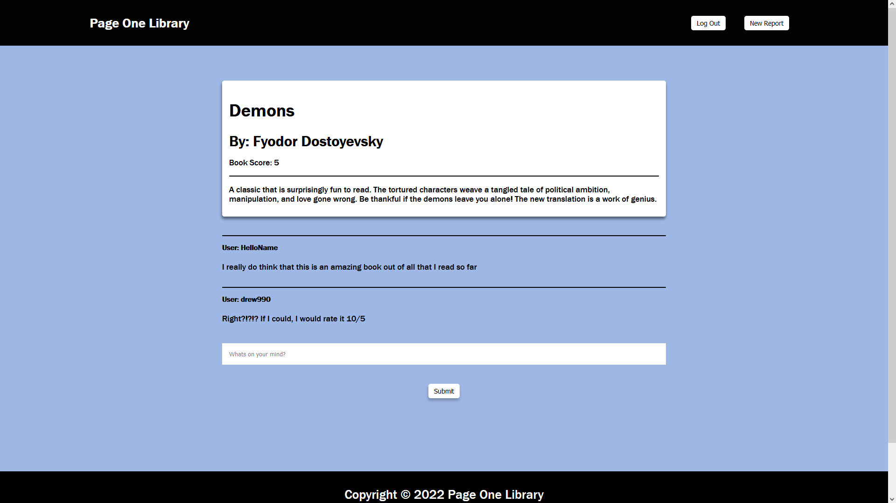

# Page One Library

Page One Library is a full stack website in which users can create an account, log in, create and view book reviews, and comment on others' posts to interact. Authentication is required to access posting and commenting functionality.

## Application Screenshots
### Home Page
 
### Login

### Create Post Page

### Individual Post Page

## Technology Used
- JavaScript
- Sequelize
- SQL
- Node.js
- Handlebars.js
- HTML/CSS
- Howler.js
- Express.js
- Dotenv
- Git
- Insomnia
- Heroku

## Usage

### Installation
To visit as a user, simply open the application hosted on Heroku.
To run the application locally, install:
- MySQL 2
- Node.js
Then clone the repository, run "npm install", log into MySQL with your username and password, and run "npm start". The application will be on port 3001.

## Created by
Sam Levin, Nitish Doss, and Andrew Banagas
